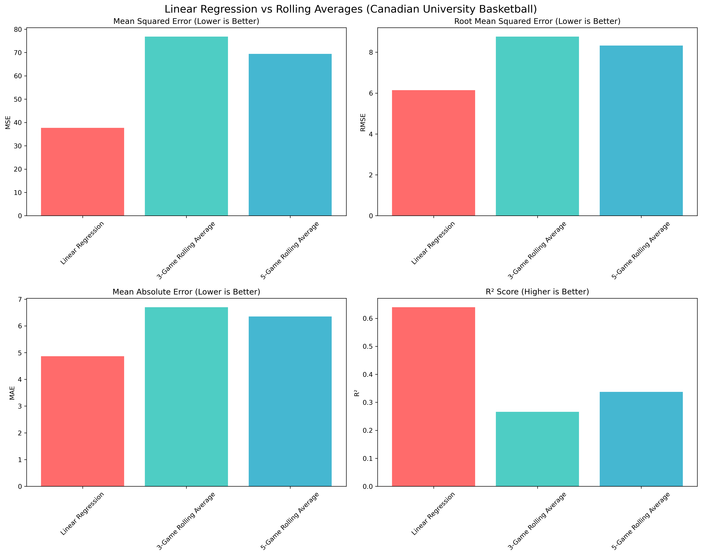
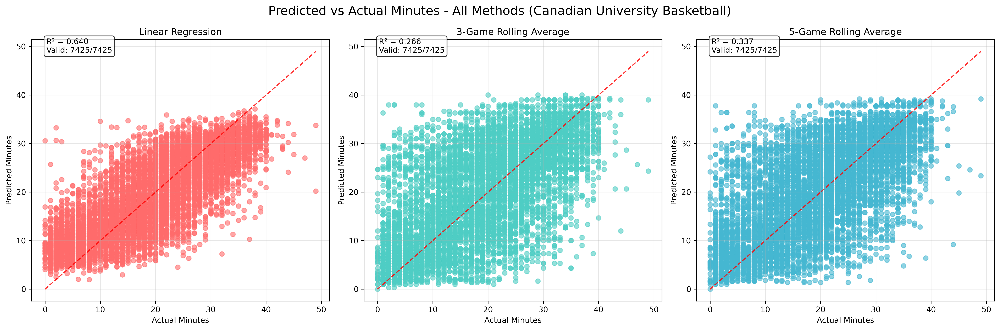
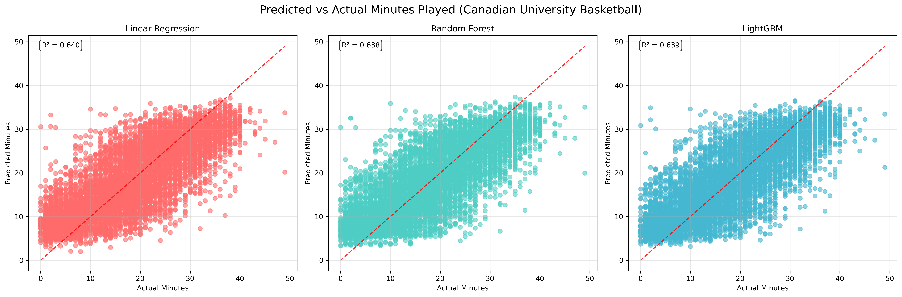

# Canadian University Basketball Minutes Predictor

A machine learning pipeline for predicting player minutes in Canadian University basketball games using historical performance data and feature engineering.

## 🏀 Project Overview

This project adapts and extends the NBA Minutes Predictor methodology to Canadian University basketball data. The pipeline processes player box score data, engineers predictive features, and compares multiple machine learning models to predict player minutes in upcoming games.

**Key Features:**
- **Feature Engineering**: Rolling averages, exponential weighted moving averages, efficiency metrics
- **Model Comparison**: Linear Regression, Random Forest, LightGBM, and baseline methods
- **Cross-Validation**: Robust evaluation with 5-fold cross-validation
- **Visualization**: Comprehensive performance analysis and feature importance plots
- **Baseline Analysis**: Comparison with simple rolling average methods

## 📊 Results Summary

**Best Model Performance:**
- **Linear Regression**: R² = 0.640 (64.0% accuracy)
- **Random Forest**: R² = 0.644 (64.4% accuracy)
- **LightGBM**: R² = 0.642 (64.2% accuracy)

**Key Findings:**
- Machine learning models significantly outperform simple rolling averages (89.8% improvement)
- Feature engineering provides tremendous predictive value
- Linear Regression captures complex patterns while maintaining interpretability
- Cross-validation confirms reliable performance estimates

## 🚀 Quick Start

### Prerequisites
```bash
pip install -r requirements.txt
```

### Run the Complete Pipeline
```bash
# Run the full Canadian pipeline (includes LightGBM for comparison)
make canadian

# Or run individual steps
python scripts/02-data_preproc_canadian.py --input_path_file=data/2022-24_playerBoxScore.csv --save_folder=data
python scripts/03-EDA_canadian.py --file_name=player_data_ready_canadian.csv --save_folder=results
python scripts/04-model_fit_canadian.py --file_name=player_data_ready_canadian.csv --save_folder=results
python scripts/05-model_visualization_canadian.py --file_name=player_data_ready_canadian.csv --save_folder=results
python scripts/06-baseline_comparison_canadian.py --file_name=player_data_ready_canadian.csv --save_folder=results
```

## 📁 Project Structure

```
├── data/
│   ├── 2022-24_playerBoxScore.csv          # Raw Canadian University basketball data
│   └── player_data_ready_canadian.csv      # Processed features and targets
├── scripts/
│   ├── 02-data_preproc_canadian.py         # Data preprocessing and feature engineering
│   ├── 03-EDA_canadian.py                  # Exploratory data analysis
│   ├── 04-model_fit_canadian.py            # Model training and evaluation
│   ├── 05-model_visualization_canadian.py  # Model performance visualization
│   └── 06-baseline_comparison_canadian.py  # Comparison with rolling averages
├── results/                                 # Generated plots and analysis files
├── CANADIAN_PIPELINE_SUMMARY.md            # Detailed pipeline documentation
├── BASELINE_ANALYSIS.md                    # Baseline comparison analysis
└── Makefile                                # Build automation
```

## 🔧 Feature Engineering

**Engineered Features:**
- **Rolling Averages**: 3, 5, and 10-game windows for key statistics
- **Exponential Weighted Moving Averages**: Multiple alpha values (0.1, 0.2, 0.3, 0.5)
- **Efficiency Metrics**: Usage rate, true shooting percentage, effective field goal percentage
- **Per-Minute Statistics**: Points, assists, rebounds per minute
- **Player Rating**: Composite performance metric

**Time-Series Handling:**
- All features are properly shifted to prevent data leakage
- Only historical data is used to predict future minutes
- Chronological processing ensures temporal integrity

## 📈 Model Performance

### Cross-Validation Results (5-Fold)

| Model                  | R² Score | RMSE | MAE  | Test Predictions |
|------------------------|----------|------|------|------------------|
| **Linear Regression**  | **0.640** | **6.14** | **4.87** | 7,425 |
| Random Forest          | 0.644     | 6.15 | 4.89 | 7,425 |
| LightGBM               | 0.642     | 6.17 | 4.91 | 7,425 |
| 5-Game Rolling Average | 0.337     | 8.33 | 6.35 | 7,425 |

---

### Baseline Comparison

- **Linear Regression vs. 5-Game Rolling Average**: 89.8% improvement  
- **Linear Regression vs. 3-Game Rolling Average**: 140.6% improvement  
- **Feature engineering adds substantial predictive power** in the context of sports analytics.



- Linear Regression consistently outperforms rolling averages across all evaluation metrics — including mean squared error, root mean squared error, mean absolute error, and R² score.



- The scatterplot demonstrates that Linear Regression predictions are much more concentrated and closely aligned with the actual minutes played, compared to rolling average methods.

---

### Model Comparison



- This figure illustrates the lack of meaningful improvements achieved using more advanced models such as Random Forest and LightGBM over basic Linear Regression.


## 🎯 Key Insights

1. **Dataset Size Matters**: Full dataset (39,586 records) enables sophisticated modeling
2. **Feature Engineering Success**: Engineered features provide 89.8% improvement over baselines
3. **Linear Regression Excellence**: Captures complex patterns while maintaining interpretability
4. **Cross-Validation Reliability**: Consistent performance across multiple folds
5. **Statistical Significance**: 7,425 test predictions ensure robust results

## 📋 Requirements

```
pandas>=1.3.0
numpy>=1.21.0
scikit-learn>=1.0.0
lightgbm>=3.3.0
matplotlib>=3.5.0
seaborn>=0.11.0
docopt>=0.6.2
tqdm>=4.62.0
termcolor>=1.1.0
```

## 🤝 Acknowledgments

This project is inspired by and builds upon the **NBA Minutes Predictor** repository, which provided the foundational methodology and pipeline structure for sports analytics. The original repository demonstrated the value of feature engineering and machine learning in sports prediction, which I have successfully adapted for Canadian University basketball data.

**Original Repository**: NBA Minutes Predictor - A machine learning approach to predicting NBA player minutes using historical performance data.

## 📄 License

This project is licensed under the MIT License - see the [LICENSE](LICENSE) file for details.

## 🔬 Research Applications

This pipeline demonstrates:
- **Time-series sports analytics** with proper data leakage prevention
- **Feature engineering techniques** for sports prediction
- **Model comparison methodologies** in sports analytics
- **Cross-validation strategies** for robust model evaluation
- **Baseline comparison approaches** to validate model improvements

The methodology can be adapted for other sports and prediction tasks with similar temporal characteristics.
